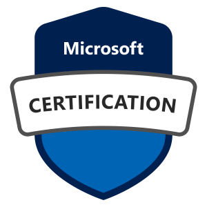

<h2 id="intro"><i class="fa fa-question-circle" aria-hidden="true"></i>Who am I?</h2>

Hi! My name is... What? My name is... Who? My name is **Dilyan Traykov**! I'm a young and ambitious software developer, amateur graphic designer, and board-game enthusiast.

I currently work as a software developer at [Progress](https://www.progress.com/) where I develop components, features and resolve bugs for the [Telerik UI for MAUI](https://www.telerik.com/maui-ui) suite.

Prior to this, I was a senior technical support engineer and assisted clients who build applications under the **WinUI, WPF and Silverlight** frameworks. You can observe a small portion of my interaction with other programmers in the [support forums](https://www.telerik.com/forums/wpf). I also write articles for our [online documentation](https://docs.telerik.com/devtools/wpf/introduction) and maintain our [GitHub repository](https://github.com/telerik/xaml-docs).

In February 2018 I became a [Microsoft Certified Professional](certificates/MCP.jpg) after first passing exams in [Software Development Fundamentals](https://www.youracclaim.com/badges/151e8110-a845-476e-bf6d-4d311780b359) and [Programming in C#](https://www.youracclaim.com/badges/e3a145bb-659d-42e1-baf1-ea10efbf9674).

In my spare time, however, I enjoy participating in coding challenges in websites such as [CodinGame](https://www.codingame.com/profile/aeba2564473c943a5c7e7799b2122b940304311), [CodeFights](https://codefights.com/profile/dTraykov) and [HackerRank](https://www.hackerrank.com/dtraykov94).

I recently started studying **Machine Learning** and already finished a few courses, including Kaggle's [Intro to Machine Learning](https://www.kaggle.com/learn/intro-to-machine-learning). Here's my [certificate](certificates/kaggle-ml-course.png) from the course.

I also like working with **Photoshop** and I've spent a couple of months designing graphic materials for the [AIESEC](http://aiesec.bg/) NGO where I shortly took the position of **Team Leader of the Communications team**.

I recently purchased a GoPro and have started learning to edit my own videos with **Adobe Premiere**. You can have a look at the ones I've created in the following [YouTube playlist](https://www.youtube.com/playlist?list=PLWFU5U48cQnTxrT-OaUY8vsdKb0VyfTGx) as well as my new YouTube channel [What Did Dido Do](https://www.youtube.com/@whatdiddidodo/videos).

<h2 id="education"><i class="fa fa-graduation-cap" aria-hidden="true"></i>Education</h2>

### "Don't let schooling interfere with your education."

I studied in the [First English Language School](https://www.fels-sofia.org/) in **Sofia** from **2008** to **2013** where I focused on **English** and **Mathematics**. In this period I helped build the school's local [newspaper's website](https://www.facebook.com/zelen.domat/) and participated in the school's football team winning the **Goalscorer trophy** in the **Bulgarian Football School League** in the **2011 / 2012** season. My final diploma grade (including the pre-university examinations) is **5.85** / 6.

I then signed up for [Sofia University](https://www.uni-sofia.bg/) and spent two years of studying **Computer Science** and stuying a lot of **algebra** and **geometry** apart from the beginner coding before deciding to drop out. During the same time I got an internship as a **Web Developer** at [Cranial Ink](https://www.cranialink.com/) where I mostly built and maintained **WordPress** websites (with **PHP** and **MySQL**).

I then rolled up for the [Telerik Academy](http://telerikacademy.com/) and in just over a year passed more than **15 courses**, most of which with **excellent grades**. I received certificates for my performance in the [C# Developer](http://my.telerikacademy.com/certificates/View/1587/30ce1177), [JavaScript Developer](https://my.telerikacademy.com/certificates/view/1684/dc9899b8), [Web Developer](https://my.telerikacademy.com/Certificates/View/1964/89e94b9a) and [Web Front-end Developer](http://my.telerikacademy.com/certificates/View/2179/d3b5390d) tracks and graduated from the academy with specialization in [Web Application Development](https://my.telerikacademy.com/certificates/view/1783/0b31ed0f). During the academy is when I got offered my first job at Progress (then Telerik) and started my long journey with desktop development.

In the summer of 2018 I actually decided that it may be a good idea to finally finish my studies and get a diploma. I signed up for the **New Bulgarian University** in Sofia and got accreditation for my two years in Sofia University so I started my studies from the 3rd year. I successfully finished the [Game Development module](https://ecatalog.nbu.bg/default.asp?V_Year=2023&Mod_ID=284&PageShow=programpresent&P_Menu=courses_part2&Fac_ID=3&M_PHD=&P_ID=2206&TabIndex=1) in the university. 

In my last year, I decided to go on the **Erasmus** program and spent my last official semester in **Zagreb** where I had lots of fun and met many interesting people with whom we still make a few reunions each year. You can see some videos from this amazing experience and our reunions in my dedicated [What Did Dido Do](https://www.youtube.com/@whatdiddidodo/videos) channel on YouTube.

To my surprise, I achieved a level of **C2** on my final [language assessment](certificates/english-assessment.pdf) after the program.

Sadly, I had to come back to Sofia in July, but I did not spend much time here as we organized a number of trips with my new Erasmus friends. I then decided to sign up for **ESN** in Sofia and am now an [official member](https://accounts.esn.org/user/dtraykov), taking my weekly dose of Erasmus experience.

<h2 id="volunteer-work"><i class="fas fa-hands-helping" aria-hidden="true"></i>Volunteer Work</h2>

I have volunteered on a number of projects including the **Elevation Music Festival** in 2012 and the **Balkan Youth Festival** in Sandanski in 2012 and 2013.

In 2018, I also did a 6-week [AIESEC](http://aiesec.bg/) exchange project in **Wroclaw, Poland** where I taught kids of ages 5 to 15 on various subjects. Here is my [certificate](certificates/AIESEC_Global_Volunteer.pdf) from this interesting adventure.

<h2 id="other-interests"><i class="fa fa-beer" aria-hidden="true"></i>Other Interests</h2>

Apart from my 9 to 5 job as a programmer, I also *"worked"* as a **guide** at the [New Sofia Pub Crawl](http://www.thenewsofiapubcrawl.com/) where I entertained foreigners with my **stupid jokes**, **lame dance moves** and **boring stories**.

As for activities, I really enjoy **board games**, **football**, **volleyball**, **basketball**, **billiards**, **tennis**, **beer pong** and pretty much any interaction which stimulates my body and brain. If you want to see what I'm capable of, here's a [compilation of my football skills](https://www.youtube.com/watch?v=5RAPqoXur74).

I sometimes participate in different marathons and take pride in my achievements in:
* [Vitosha 100](certificates/vitosha-100.pdf): **100km for 18h 52min** after almost zero preparation.
* [Brutus Run](https://www.irun.bg/external.php/competition/result/name/brutus-run-2017/distance/378): **21km for 3h 55min** in -5 degrees with different challenges along the way after getting lost 2 times.
* [The Big Tech Run](https://techrun.bg/results-2016-2/): **10km for 49min 13sec**.

<h2 id="contact-me"><i class="fa fa-envelope" aria-hidden="true"></i>Contact Me</h2>

Do you find this website **lame** and **uninformative**? I do too.

If you want to learn more about me, chat, or meet up, please have a look at all the social media links I've provided in the footer section. Thanks for your interest.